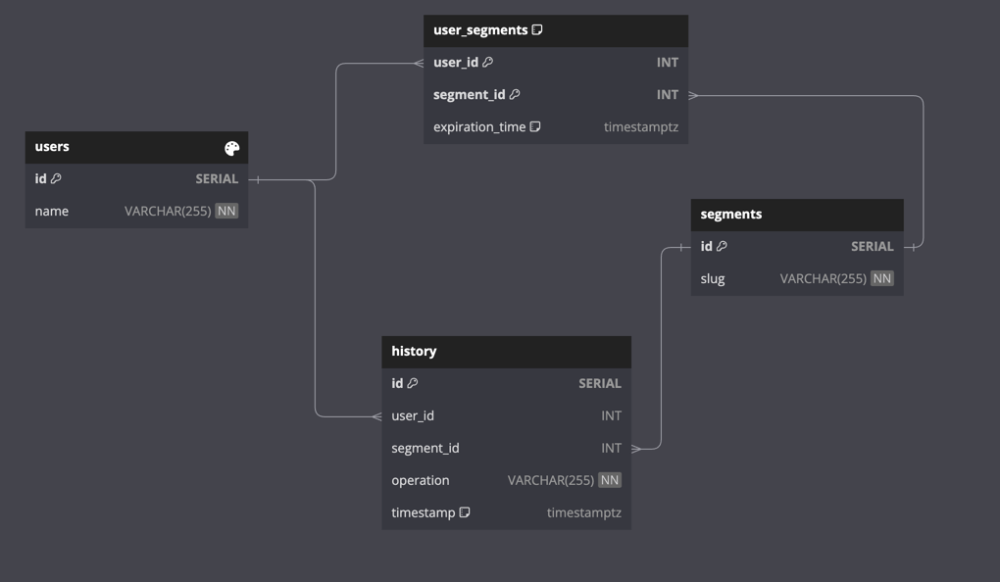
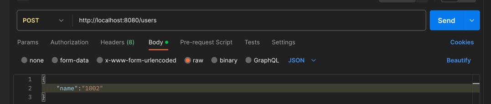
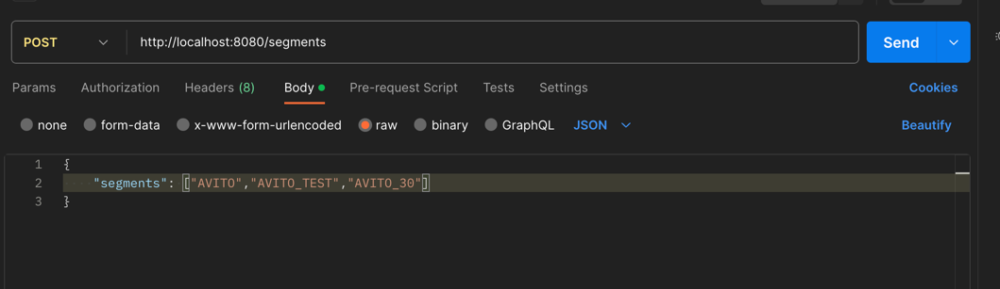
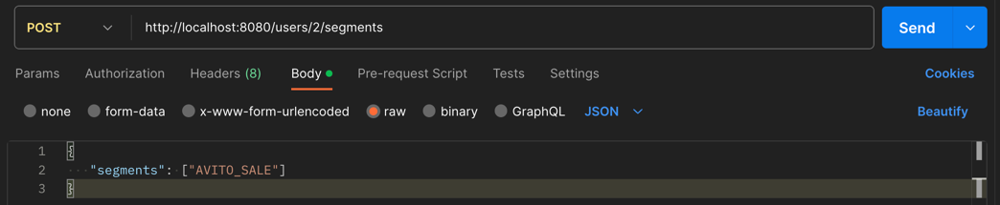
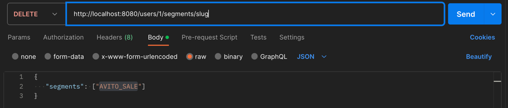
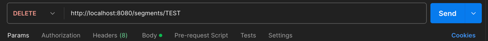
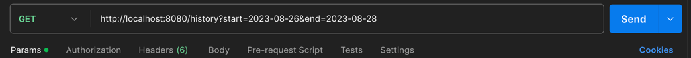
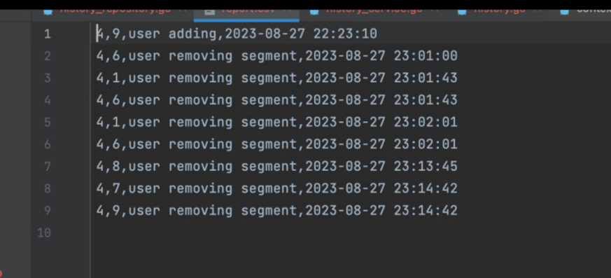
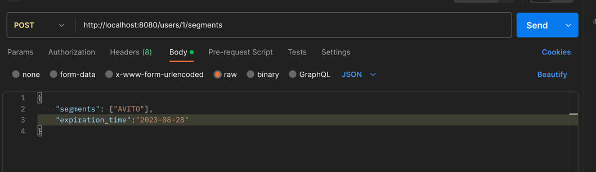

# Тестовое задание для стажёра Backend
# Сервис динамического сегментирования пользователей

### Проблема:

В Авито часто проводятся различные эксперименты — тесты новых продуктов, тесты интерфейса, скидочные и многие другие.
На архитектурном комитете приняли решение централизовать работу с проводимыми экспериментами и вынести этот функционал в отдельный сервис.

## Решение задания

Для решения задачи были выполнены следующие шаги:
1. Была разработана схема хранения данных
2. Был спроектирован сервис для работы с данными

## Схема базы данных

На схеме отображены осноные сущности:
1. Пользователи в таблице users
2. Сегменты в таблице segments
3. История событий в таблице history

Также в качестве связущего звена была добавлена таблица user_segments

## API сервиса
Для взаимодействия с сервисом был опрделн набор http-запросов

Ниже описаны и изабражены варианты взаимодействия с сервисом и запросы:

- Добавление пользователя в базу данных

Для добавление пользователя в базу данных необходимо направить следующий запрос:
>
- Добавление сегмента в базу данных

Для добавления нового сегмента (или списка сегментов) в базу данных необходимо направить следующий запрос:
>

- Добавление сегмента к определенному пользователю

Для добавления сегмента определнному пользователю необходимо выполнить следующий запрос:

>

- Получение информации о всех сегментах пользователя

Для получения информации о всех сегментах пользователя необходимо направить следующий запрос:

> 

* Удаление сегмента у пользователя

Для удаления сегмента у пользователя необходимо выполнить следующий запрос:

>

* Удаление сегмента из базы сегментов

Для удаления сегмента из базы необходимо выполнить следующий запрос:

> 

- Получение отченотности о событиях за временной период

* Для получения отчета в виде файла csv об истории событий необходимо направить следующий запрос:

> 
> 
> Резултат выполнения этого запроса можно найти в файле report.csv
> 
> (Пример)

* Специальные запросы
> 
> Для проверки выполнения дополнителного задания номер 2 (добавить пользователя в сегмент на время)
> Необходимо в теле запроса указать дополнительный пармтер - время удаления пользователя из сегмента в формате
> 
> Раз в час сервис будет проверять пользователей у которых нужно удалить избарнные сегменты

## Запуск сервиса
Для запуска сервиса необходимо выполнить следующие шаги

Слонировать репозиторий и перейти в папку с проектом
>git clone https://github.com/ArkaDiyoZ/AvitoTestTask.git

Последовательно выполнить в терминале (в корневой папке проекта) следующие команды:
> make build
> 
> make run
> 
> make run (да необходимо 2 раза выполнить запуск, об этом ниже)

Открыть приложение (postman или люое другое) и направить ряд желаемых запросов к сервису по иструкции описанной выше

## Выполненные задачи:
- Была разработана база данных и сервис для взаимодействия с данным
- Сервис и база данных запускаются при помощи docker-compose
- Выполнеы допольнительные задания 1 и 2 
- В проект установлен swagger для описания документации

## Что не было сделано:
- Не выполнено дополнительное задание номер 3
- Код не покрыт unit-тестами (хотя все для них подготовлено - установлен Mockgen)
- Документация в swagger не описана

## Что можно было бы улучишть?:
- Покрыть код тестами
- Улучшить архитектуру - добавить больше абстракции и привести все к более "Чистой архитектуре"
- Предусмотреть механизм миграции данных
- Отойти от orm gorm
- Запуск приложения вводом единичной комады make up (сейчас необходимо выполнить ее два раза)